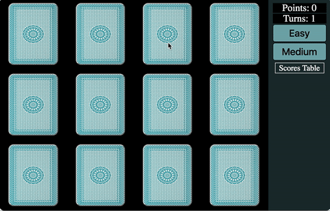

## memory_game
made in vue.js 2.0

[Simple Live Demo](https://robert01101010.github.io/memory_game/indexDemo.html)

## Screenshot



## Setup
``` bash
# install dependencies
npm install

# serve with hot reload at localhost:8080
npm run dev

# build for production with minification
npm run build
```

### License

[MIT](http://opensource.org/licenses/MIT)
